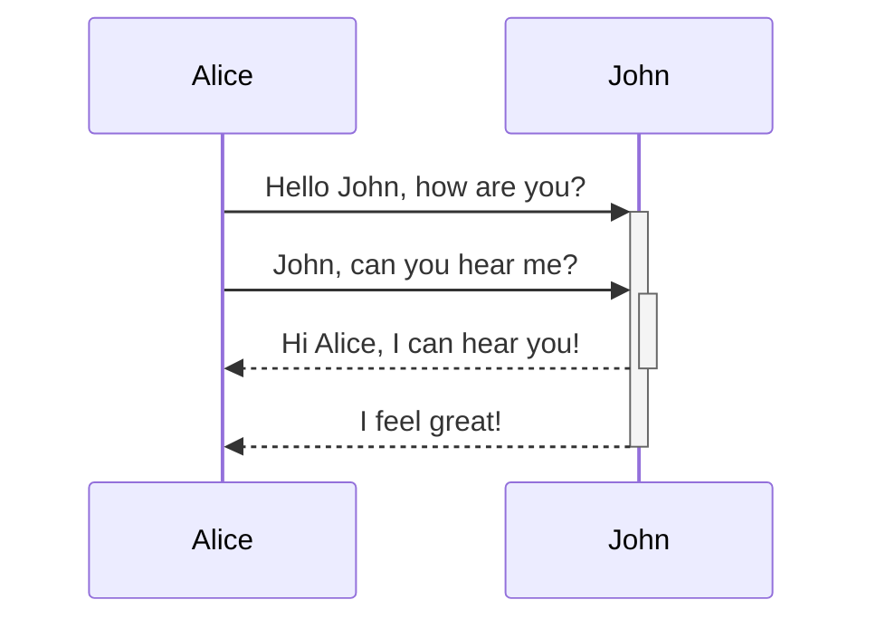

# Markdown

> [!tip]- HISTORY
> Markdown is a **text-to-HTML** conversion tool for web writers. Markdown allows you to write using an easy-to-read, easy-to-write plain text format, then convert it to structurally valid XHTML (or HTML).
>
> Documentation: [Markdown Docs](https://daringfireball.net/projects/markdown/)
> RFC: [RFC 7763](https://www.rfc-editor.org/rfc/rfc7763)
> GitHub Documentation: [Writing Markdown on GitHub](https://docs.github.com/en/get-started/writing-on-github)
> 
> > [!info] Useful links: 
> > - [Markdown Guide](https://www.markdownguide.org/cheat-sheet)
> > - [Obsidian Index](https://help.obsidian.md/Obsidian/Index)


## Cheat-Sheet

### Headings
```markdown
# Heading 1
## Heading 2
### Heading 3
#### Heading 4
##### Heading 5
###### Heading 6
```

> [!info] Example
> # Heading 1
> ## Heading 2
> ### Heading 3
> #### Heading 4
> ##### Heading 5
>  ###### Heading 6

### Tags
```markdown
#Game #Linux
```

> [!info] Example
> #Game #Linux

### Emphasis
```markdown
Emphasis, aka italics, with *asterisks* or _underscores_.

Strong emphasis, aka bold, with **asterisks** or __underscores__.

Combined emphasis with **asterisks and _underscores_**.

Strikethrough uses two tildes. ~~Scratch this.~~
```

> [!info] Example
> Emphasis, aka italics, with *asterisks* or _underscores_.
> Strong emphasis, aka bold, with **asterisks** or __underscores__.
> Combined emphasis with **asterisks and _underscores_**.
> Strikethrough uses two tildes. ~~Scratch this.~~

### Hightlight
```markdown
You can ==highlight== text
```

> [!info] Example
> You can ==highlight== text

### Lists

#### Ordered Lists
```markdown
1. First item
2. Second item
3. Third item
```
or
```markdown
1. First item
1. Second item
1. Third item
```

> [!info] Example
> 1. First item
> 2. Second item
> 3. Third item

#### Unordered Lists
```markdown
- First item
- Second item
- Third item
```

> [!info] Example
> - First item
> - Second item
> - Third item

### In Links
#### Basic link
```markdown
[[Markdown Linkable Note]]
```

> [!info] Example
> [[Markdown Linkable Note]]

#### Embed link
```markdown
![[Markdown Linkable Note]]
```

> [!info] Example
> ![[Markdown Linkable Note]]

### Out Links
#### Basic link
```markdown
Link with text: [link-text](https://www.google.com)
Relative link with text: [Solidity](/Blockchain/Solidity/Solidity)
```

> [!info] Example
> Link with text: [link-text](https://www.google.com)
> Relative link with text: [[Markdown + Obsidian]]

#### Embed link
```HTML
<iframe 
		height="300" 
		width="100%"
		src="https://help.obsidian.md/Editing+and+formatting/Embedding+web+pages">
</iframe>
```

> [!info] Example
> <iframe height="300" width="100%" src="https://help.obsidian.md/Editing+and+formatting/Embedding+web+pages"></iframe>

### Images
```markdown
<pre>
Image with alt text and size WxH: 

Relative image: ![[Ethereum.png|50x50]]
</pre>
```

> [!info] Example
> Image with alt text: 
> 
> Relative image: ![[Ethereum.png|50x50]]

### Code Blocks

#### Inline Code Block
```markdown
Inline `code` has `back-ticks around` it.
```

Inline `code` has `back-ticks around` it.

#### Blocks of Code
<pre>
```javascript
var s = "JavaScript syntax highlighting";
alert(s);
```
 
```python
s = "Python syntax highlighting"
print s
```
 
```
No language indicated, so no syntax highlighting. 
But let's throw in a <b>tag</b>.
```
</pre>

> [!info] Example
> ```javascript
> var s = "JavaScript syntax highlighting";
> alert(s);
> ```
 > >
> ```python
> s = "Python syntax highlighting"
> print s
> ```
> >
> ```
> No language indicated, so no syntax highlighting. 
> But let's throw in a **tag**.
> ```

### Tables

There must be at least 3 dashes separating each header cell.
The outer pipes (|) are optional, and you don't need to make the raw Markdown line up prettily.

```markdown
| Heading 1 | Heading 2 | Heading 3 |
|---|---|---|
| col1 | col2 | col3 |
| col1 | col2 | col3 |
```

> [!info] Example
>
> | Heading 1 | Heading 2 | Heading 3 |
> |---|---|---|
> | col1 | col2 | col3 |
> | col1 | col2 | col3 |

### Task list

```markdown
- [x] Write the post
- [ ] Update the website
- [ ] Contact the user
```

> [!info] Example
> - [x] Write the post
> - [ ] Update the website
> - [ ] Contact the user

### Callouts
```
> [!ATTENTION]- ALWAYS VISIBLE TITLE
> Compressed (hide) message

> [!TIP] ALWAYS VISIBLE TITLE
> Always visible text message

> [!question] Can callouts be nested?
> > [!todo] Yes!, they can.
> > > [!example]  You can even use multiple layers of nesting.
```

> [!ATTENTION]- ALWAYS VISIBLE TITLE
> Compressed (hide) message

> [!TIP] ALWAYS VISIBLE TITLE
> Always visible text message

> [!question] Can callouts be nested?
> > [!todo] Yes!, they can.
> > > [!example]  You can even use multiple layers of nesting.

#### Typology
- Note
> [!note]
> Lorem ipsum dolor sit amet

- Abstract (aliases: summary, tldr)
> [!abstract]
> Lorem ipsum dolor sit amet

- Info
> [!info]
> Lorem ipsum dolor sit amet

- Todo
> [!todo]
> Lorem ipsum dolor sit amet

- Tip (aliases: hint, important)
> [!tip]
> Lorem ipsum dolor sit amet

- Success (aliases: check, done)
> [!success]
> Lorem ipsum dolor sit amet

- Question (aliases: help, faq)
> [!question]
> Lorem ipsum dolor sit amet

- Warning (aliases: caution, attention)
> [!warning]
> Lorem ipsum dolor sit amet

- Failure (aliases: fail, missing)
> [!failure]
> Lorem ipsum dolor sit amet

- Danger (alias: error)
> [!danger]
> Lorem ipsum dolor sit amet

- Bug
> [!bug]
> Lorem ipsum dolor sit amet

- Example
> [!example]
> Lorem ipsum dolor sit amet

- Quote (alias: cite)
> [!quote]
> Lorem ipsum dolor sit amet

### Diagram (Mermaid)
> [!info]- Mermaid
> 
> ###### Diagramming and charting tool
> JavaScript based diagramming and charting tool that renders Markdown-inspired text definitions to create and modify diagrams dynamically.
> 
> [Mermaid.js.org](https://mermaid.js.org/)

Obsidian uses Mermaid to render diagrams and charts. Mermaid also provides [a helpful live editor](https://mermaid-js.github.io/mermaid-live-editor)

````markdown

````

> [!info] Example
> ```mermaid
> sequenceDiagram
>  Alice->>+John: Hello John, how are you?
>  Alice->>+John: John, can you hear me?
>  John-->>-Alice: Hi Alice, I can hear you!
>  John-->>-Alice: I feel great!
> ```

#### Typology
##### Sequence
![[Sequence Diagram#Intro]]
##### Flow
![[Flow#Intro]]
##### Class
![[Class diagrams#Intro]]

##### State
![[State diagram#Intro]]

##### ER
![[Entity Relationship#Intro]]
##### Gantt
![[Gantt#Intro]]

##### User Journey
![[User Journey Diagram#Intro]]

##### Git
![[Git#Intro]]

##### Pie
![[Pie#Intro]]
### Slides (core plugin)
Slides lets you create presentations from your notes. To start a presentation:

**File menu:**
-   Right-click the tab of a note and click **Start presentation**.

**Command palette:**
1.  Press `Ctrl+P` (or `Cmd+P` on macOS) to open the [Command palette](https://help.obsidian.md/Plugins/Command+palette).
2.  Search for the **Start presentation** command.
3.  Press `Enter` with the command selected to start a presentation using the active note.

To navigate between slides, click the left and right arrows in the bottom-right corner, or press the left and right arrow keys on your keyboard.

You can also advance to the next slide by pressing Spacebar.

To stop the presentation, press `Escape` or click the cross in the upper-right corner of the presentation.

You can use any valid Markdown file as a presentation. To separate slides, enter `---` at the start of a line surrounded by newlines.

```
# Presentations using Slides

A demo on how to build presentations using Slides.

---

## Formatting

You can use regular Markdown formatting, like *emphasised* and **bold** text.

---

## Slides

Use `---` to separate slides.
```

> [!tip] ProTIP
> Try the [[Slides demo]] to see Slides in action.

